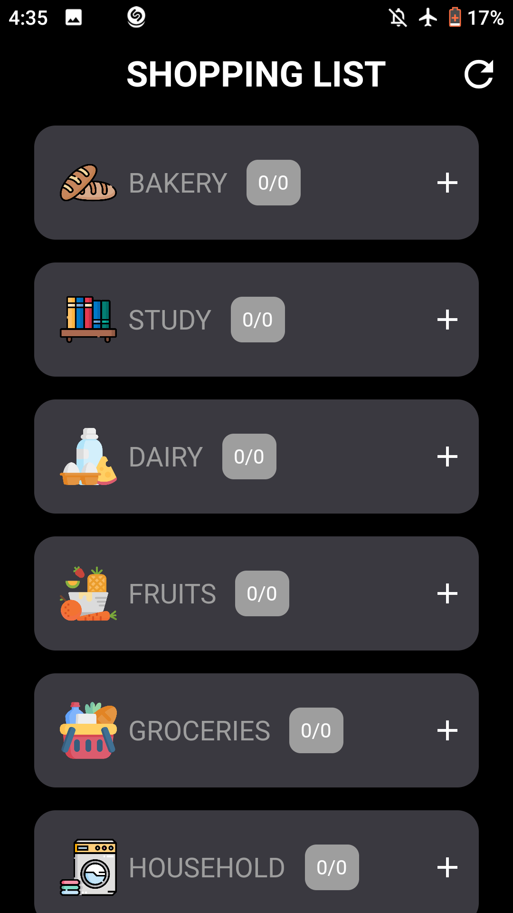
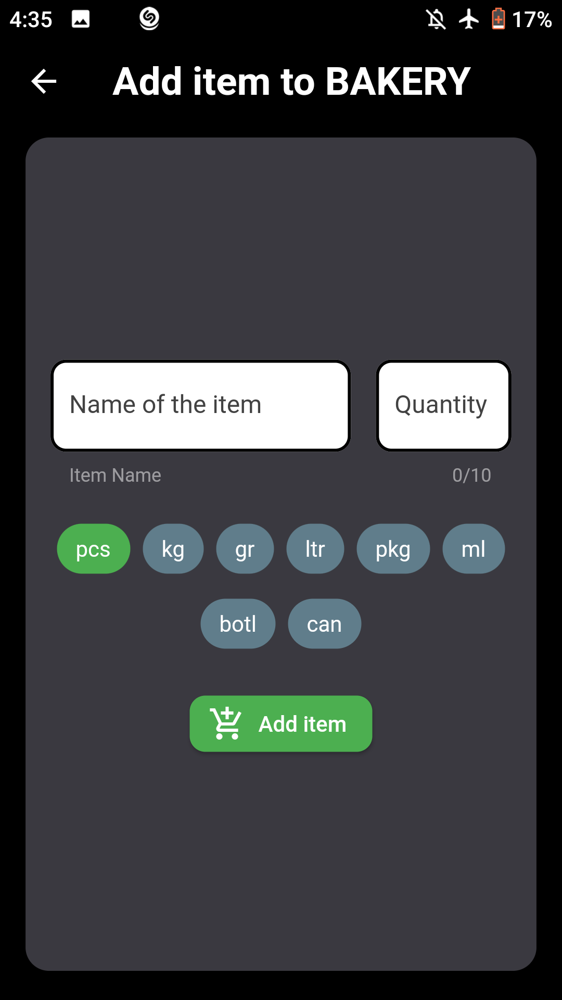
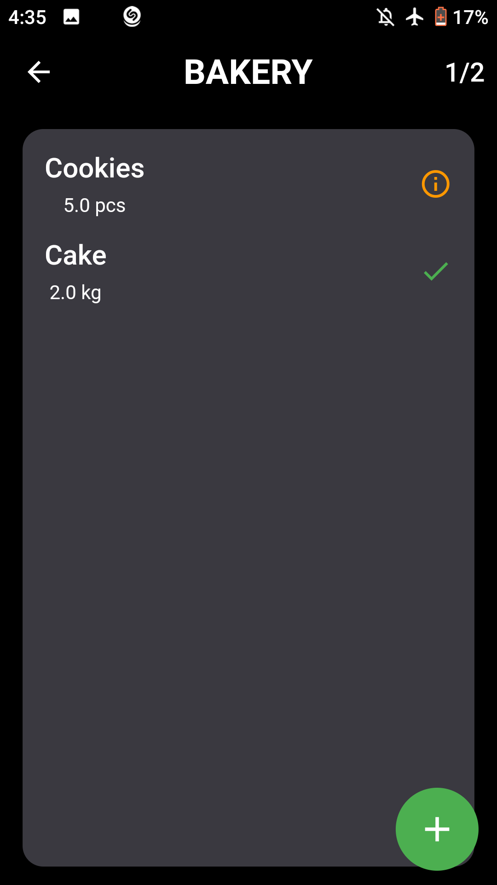
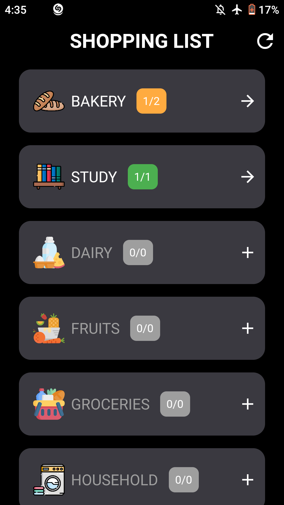
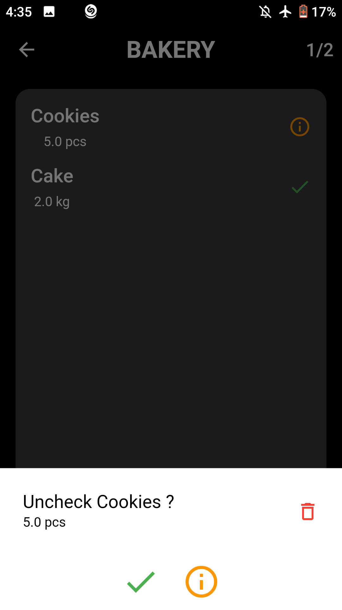
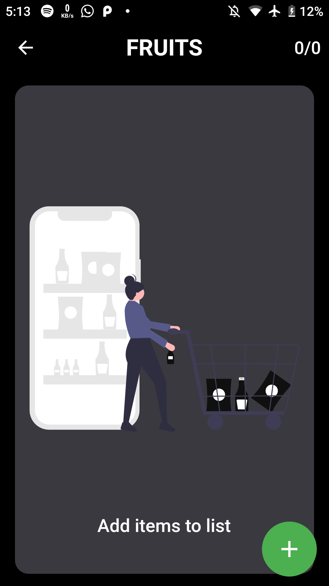

# UN Check

A minimal  Shopping list management Application built using Flutter and Hive.

UN Check is free and Open Source, Cross Platform Application developed using [Flutter](https://github.com/flutter/flutter).

## Download the App

## About
Adding shopping items with category quantity , having a minimal and user friendly interface. 

### The android app lets you:

- Add item to category.
- Add quantity
- Edit item
- Un-check items

## Screenshots

### Home Screen

### Add item

### Items List

### Category List

### Item action

### Empty List

## Permissions

On Android versions prior to Android 6.0, MooovieX requires the following permissions:
- Storage Acces - Saving offline on the device .

## Contributing

UN Check  app is a free and open source project. Any contributions are welcome. Here are a few ways you can help:
 * [Report bugs and make suggestions.](https://github.com/adarshbalu/un_check/issues)
 

## Credits  

Thanks to  Freepik (http://www.freepik.com) for the app icon.

## License

This application is released under GNU GPLv3 (see [LICENSE](LICENSE)).
Some of the used libraries are released under different licenses.

